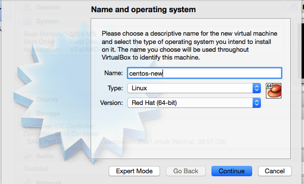
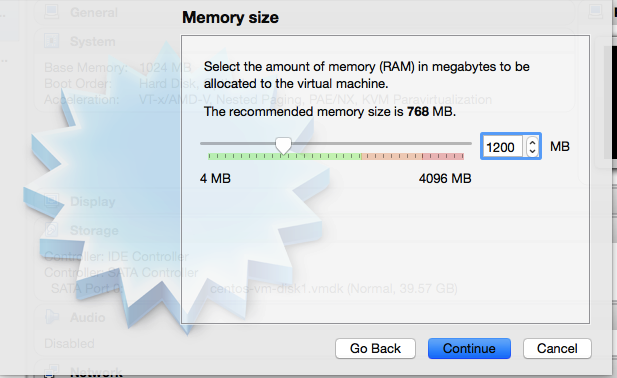
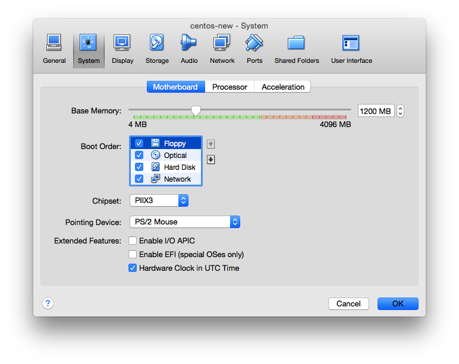
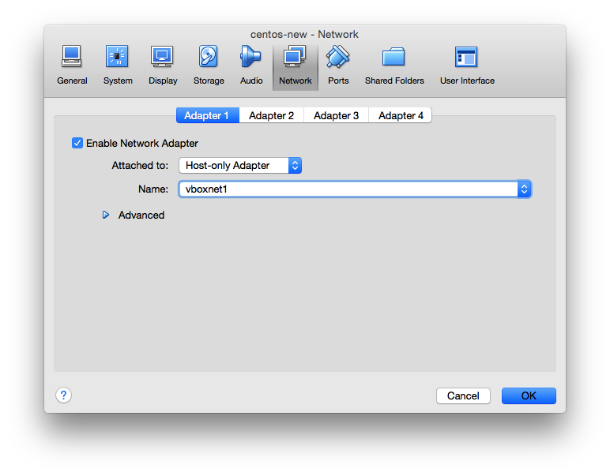
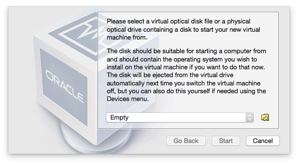
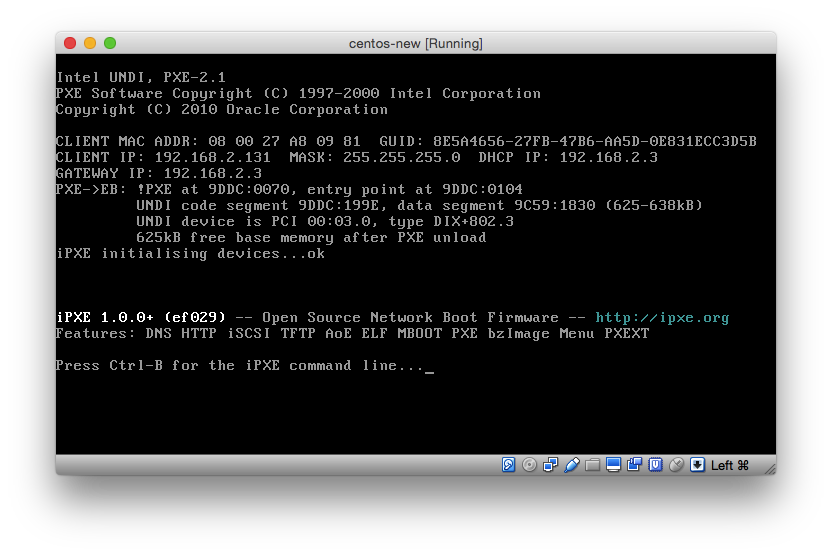
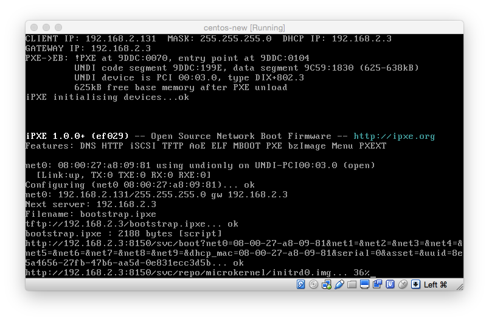
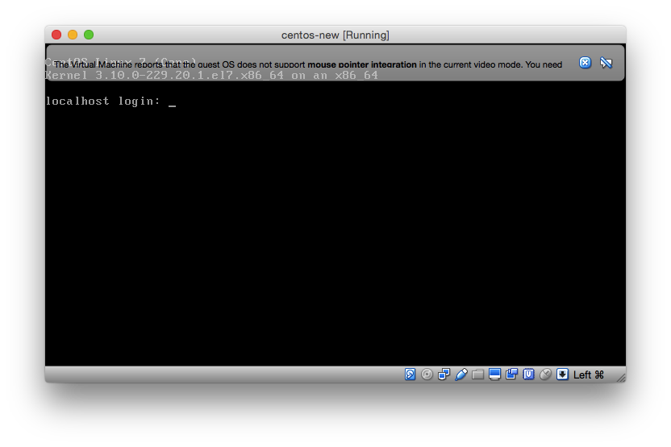
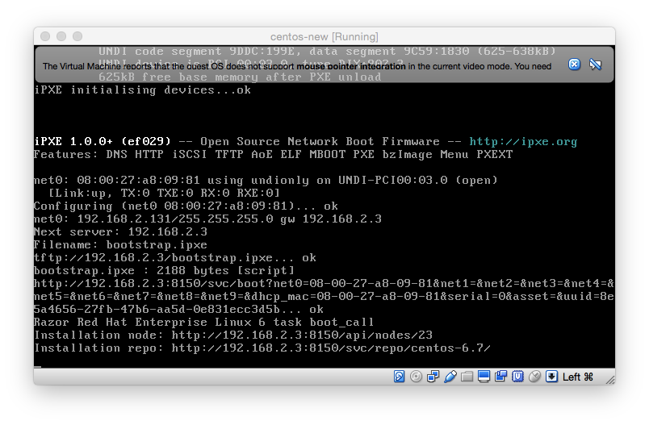

# Setting up RAZOR server using ansible

## Install Ansible on OS X

```

  sudo easy_install pip
  sudo pip install ansible
	ansible --version

[output]
  ansible 2.0.1.0
  config file = /path/to/ansible.cfg
  configured module search path = Default w/o overrides

```
Edit Vagrantfile and vars.yml according your requirement. If not modified, the playbook will also work.

### To create and config the infra.

Run the vagrant-up.sh from command line.

<pre>
	./vagrant-up.sh
</pre>

Once the play book is executed completely, run the following commands to setup razor server.

### Razor setup

To create repo, Log in to razor server created earlier and download the ISO file of the OS.


E.g.

<pre>
	sudo su -
	wget http://centosmirror.go4hosting.in/centos/6.7/isos/x86_64/CentOS-6.7-x86_64-minimal.iso
	chown razor:razor  CentOS-6.7-x86_64-minimal.iso
 	razor create-repo --name=centos6.7  --iso-url file:///root/CentOS-6.7-x86_64-minimal.iso --task centos
 	wget http://releases.ubuntu.com/14.04/ubuntu-14.04.3-server-amd64.iso
 	chown razor:razor ubuntu-14.04.3-server-amd64.iso
 	razor create-repo --name=ubuntu-14.04 --iso-url file:///root/ubuntu-14.04.3-server-amd64.iso
</pre>

Now create a folder called **repo-mount** and mount iso file onto the  **repo-mount**.

<pre>
	mount -o loop CentOS-6.7-x86_64-minimal.iso repo-mount
</pre>

create a folder with name same as the repo inside /var/lib/razor/repo-store/ and copy the contents of repo-mount into the directory.

<pre>
	mkdir /var/lib/razor/repo-store/centos-6.7/
	cp -rf repo-mount/*  /var/lib/razor/repo-store/centos-6.7/
</pre>

Now unmount the centos iso and mount ubuntu ISO

<pre>
	umount repo-mount
	mount -o loop ubuntu-14.04.3-server-amd64.iso repo-mount
	mkdir /var/lib/razor/repo-store/ubuntu-14.04
	cp -rf repo-mount/*  /var/lib/razor/repo-store/ubuntu-14.04
	chown razor:razor -R /var/lib/razor/repo-store/
	umount repo-mount
</pre>


To view the repos

<pre>
	razor repos
</pre>


To Create Broker

Execute the following command on razor server.

<pre>
	razor create-broker --name=noop --broker-type=noop
</pre>


To view broker

<pre>
	razor brokers
</pre>


To Create Tag

<pre>

	razor create-tag --name micro --rule '["<", ["num", ["fact", "memorysize_mb"]], 1000]'

	razor create-tag --name small  --rule '[">", ["num", ["fact", "memorysize_mb"]], 1000]'

</pre>

This will create two tags "small" and "micro"

To view tags

<pre>
	razor tags
</pre>

To creata a policy that will load centos  for small VMs

create a file with name **centos-small.json**" and contents

<pre>

{
  "name": "centos-for-small",
  "repo": "centos-6.7",
  "task": "centos",
  "broker": "noop",
  "enabled": true,
  "hostname": "host${id}.initcron.com",
  "root_password": "AbhI",
  "max_count": 100,
  "tags": ["small"]
}

</pre>


and file named **ubuntu-micro.json**


<pre>
	{
  "name": "ubuntu-for-micro",
  "repo": "ubuntu-14.04",
  "task": "ubuntu/trusty",
  "broker": "noop",
  "enabled": true,
  "hostname": "host${id}.initcron.com",
  "root_password": "AbhI",
  "max_count": 100,
  "tags": ["micro"]
}
</pre>

Now execute cmd

<pre>

	razor create-policy --json ubuntu-micro.json

	razor create-policy --json  centos-small.json

</pre>

To view polices

<pre>
	razor policies
</pre>


###To test the setup


create a VM in virtual box

* Click **New**  



* Click **Continue** and change the memnory to 1200   




* Click **Continue**, then **Create**, then **Continue**, then **Continue**, then **Create**

  this will create you VM

* Now modify the VM to allow network boot   

  Click on newly created VM and the **Settings**, click on **System** and do the changes like the following



* Now modify VM to get launched on the same net as razor server i.e private network

  click on **Network** and do the changes as



   Click **OK**

* To start VM, click **Start**

  you will see a screen,



  click **cancel**

* Now you should see something like this.



  This verify that your VM is booting from Network.
  The GateWay IP in your case will will same as private network IP of razorserver in VagrantFile

* Now you will see that micro-kernel is getting loaded into VM.



* Next you will this screen, that verifies that the micro-kernel is loaded.



* Now razor will load the new OS on your VM depending on your policy.


